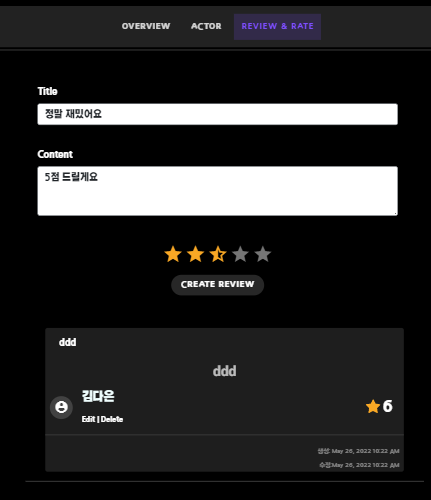
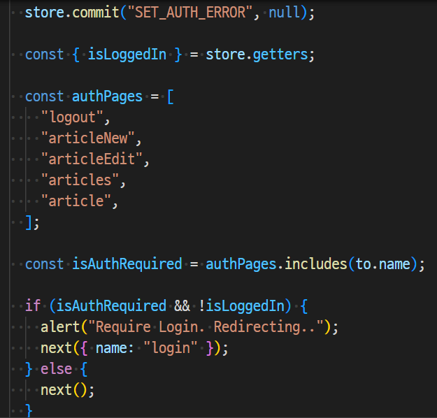
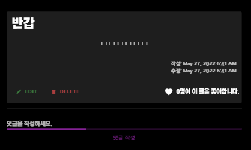
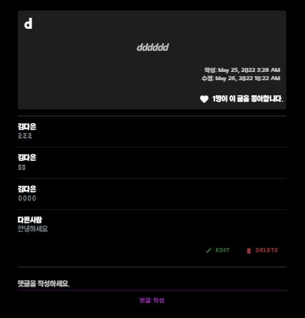

# Final Project


### [ACHCA] 영화 추천 및 커뮤니티 사이트


### 팀원 정보 및 업무 분담 내역

|            | 프레임워크 | 팀원   |
| ---------- | ---------- | ------ |
| 백엔드     | django     | 홍석현 |
| 프론트엔드 | vue.js     | 김다은 |


---

### 목표 서비스 구현 및 실제 구현 정도 

* 목표 서비스

  - 회원정보 기능(로그인, 로그아웃, 회원수정, 회원삭제) 
  - 전체 영화 목록 조회
  - 장르별 영화 조회
  - 영화 검색
  - 영화 상세보기 페이지
  - 영화 추천 페이지
  - 유튜브 동영상 연동
  - 예매 =>지도 API(현재 위치 클릭하면 근처 영화관 예매사이트 연결)
  - 영화에서 예매페이지 연계
  - 즐겨찾기
  - 영화 리뷰페이지
  - 신박한 영화 추천알고리즘

  


---


### 데이터베이스 모델링 (ERD) 

* #### Django

  


* #### Vue

  

---


### 필수 기능에 대한 설명 

#### A. 관리자 뷰


* `python manage.py createsuperuser` 로 관리자를 설정해주어 주소/admin으로 접근이 가능하도록 해주었다.

* movies/admin.py

  ```python
  from django.contrib import admin
  from .models import Movie, Review
  # Register your models here.
  
  admin.site.register(Movie)
  admin.site.register(Review)
  ```

  * 관리자 권한으로 영화와 리뷰들을 관리하기 위해 admin사이트에 각각 모델들을 등록해주어 영화 등록 / 수정 / 삭제 권한을 가지게 해주었다.


#### B. 영화 정보

* TMDB API를 활용해 json형식으로 데이터를 받아 미리 테이블에 저장

* 인기 영화데이터 500개 사용

  ```python
  # 장르 정보
  import requests
  import json
  
  TMDB_API_KEY = '9fd49ab00d660f7801565ddb3d5db886'
  
  def get_genre_datas():
      total_data = []
  
      request_url = f"https://api.themoviedb.org/3/genre/movie/list?api_key={TMDB_API_KEY}&language=ko-KR"
      genres = requests.get(request_url).json()
      # print(genres)
      for genre in genres['genres']:
          # print(genre, type(genre))
          fields = {
              'name': genre['name'],
              }
          data = {
              "model": "movies.genre",
              "pk": genre['id'],
              "fields": fields,
          }
  
          total_data.append(data)
  
      with open("./movies/fixtures/movies/genres.json", "w", encoding="utf-8") as w:
          json.dump(total_data, w, ensure_ascii=False)
  
  get_genre_datas()
  ```

  ```python
  # 영화, 배우 정보
  import requests
  import json
  
  TMDB_API_KEY = '9fd49ab00d660f7801565ddb3d5db886'
  
  
  def get_movie_datas():
      total_data = []
      total_actor = []
      # 1페이지부터 500페이지까지 (페이지당 20개, 총 10,000개)
      for i in range(1,25):
          request_url = f"https://api.themoviedb.org/3/movie/popular?api_key={TMDB_API_KEY}&language=ko-KR&page={i}"
          movies = requests.get(request_url).json()
  
          for movie in movies['results']:
              if movie.get('release_date', ''):
                  fields = {
                      'movie_id': movie['id'],
                      'title': movie['title'],
                      'release_date': movie['release_date'],
                      'popularity': movie['popularity'],
                      'vote_avg': movie['vote_average'],
                      'overview': movie['overview'],
                      'poster_path': movie['poster_path'],
                      'genres': movie['genre_ids'],
                      'director': '',
                      'actors': [],
                  }
  
                  data = {
                      # "pk": movie['id'],
                      "model": "movies.movie",
                      "fields": fields,
                  }
  
                  total_data.append(data)
  
      for data in total_data:
          movie_id = data['fields']['movie_id']
  
          credit_request_url = f"https://api.themoviedb.org/3/movie/{movie_id}/credits?api_key={TMDB_API_KEY}&language=ko-KR"
          credit_info = requests.get(credit_request_url).json()
          # print(credit_request_url)
          # print(credit_info)
          # 배우는 최대 10명까지만 저장한다.
          for cast in credit_info['cast'][:10]:
              actor_field ={
                  'credit_id': cast['credit_id'],
                  'actor_name': cast['name'],
                  'img_key': cast['profile_path']
              }
              # print(cast)
              # data['fields']['actors'].append({cast['name']:cast['profile_path']})
              data['fields']['actors'].append(cast['id'])
              actor_data = {
                  'model': 'movies.actor',
                  'pk': cast['id'],
                  'fields': actor_field,
              }
              if actor_data not in total_actor:
                  total_actor.append(actor_data)
          if credit_info['crew']:
              # data['director'] = credit_info['crew'][0]['name']
              data['fields']['director'] = credit_info['crew'][0]['name']
  
      for data in total_data:
          movie_id = data['fields']['movie_id']
          video_request_url = f'https://api.themoviedb.org/3/movie/{movie_id}?api_key={TMDB_API_KEY}&append_to_response=videos'
          # print(video_request_url)
          video_info = requests.get(video_request_url).json()
          if video_info['videos']['results']:
              # print(movie_id, video_info['videos']['results'][0]['key'])
              data['fields']['video_key'] = video_info['videos']['results'][0]['key']
  
      with open("./movies/fixtures/movies/movies.json", "w", encoding="utf-8") as w:
          json.dump(total_data, w, ensure_ascii=False)
  
  
      with open("./movies/fixtures/movies/actors.json", "w", encoding="utf-8") as w:
          json.dump(total_actor, w, ensure_ascii=False)
  get_movie_datas()
  ```

- movie를 FK로 Review모델을 생성 
- 로그인이 되어 토큰이 유효할때만 CUD 가능
- 각 영화에 평점과 리뷰글을 쓸 수 있다




#### C. 영화추천 알고리즘

* movies/view.py

  ```python
  @api_view(['GET'])
  def recommended(request):
      ## 추천 알고리즘
      
      # 1.영화 평점 순
      top_vote_avg_movies = Movie.objects.all().order_by('-vote_avg')[:10]
      serializer1 = MovieListSerializer(top_vote_avg_movies, many=True)
      # return Response(serializer.data)
  
      # 2. 사용자 리뷰 평점 순
      top_user_rank_movies = Movie.objects.annotate(
          reviews_rank_avg = Avg('reviews__rank', distinct=True)
      ).all().order_by('-reviews_rank_avg')[:10]
      serializer2 = MovieListSerializer(top_user_rank_movies,many=True)
  
      # 3. 사용자 누른 좋아요(즐겨찾기) 갯수 순
      top_user_favorite_movies = Movie.objects.annotate(
          favorite_count = Count('like_users', distinct=True)
      ).all().order_by('-favorite_count')[:10]
      serializer3 = MovieListSerializer(top_user_favorite_movies,many=True)
      
      # 4. (최신 + 인기) 평점 높은 영화 
      popularity_100 = Movie.objects.all().order_by('-popularity')[:200]
      recent_100 = Movie.objects.all().order_by('-release_date')[:200]
      sum_movies = (popularity_100 | recent_100).order_by('-vote_avg')[:10]
  
      serializer4 = MovieListSerializer(sum_movies,many=True)
      
      return Response([serializer1.data, serializer2.data, serializer3.data, serializer4.data])
  
  ```

  * 4가지 추천 알고리즘을 사용

    1. 영화 평점이 높은 10개

    2. 사용자가 영화에 남긴 리뷰들의 평균 내서 그 평균이 높은 영화 10개

    3. 사용자가 영화에 좋아요 누른 갯수가 많은 영화 10개

    4. 최신 영화 + 인기 영화 각각 200개씩을 더해서 그 중에 평점이 높은 영화 10개

    

  * 4가지 방직을 serialzer로 보내기 위해 리스트로 묶어 프론트로 데이터를 보내주었다.


#### D. 커뮤니티

- 커뮤니티 접근 / 게시글 작성 기능

  - 전역가드를 통해 로그인된 사용자만 접근 가능

    

  

* 수정 삭제

  * 본인 글/댓글일때만 수정/삭제가 가능

  

  


---


### 배포 서버 URL (배포했을 경우) 

```http
https://achca-movies.netlify.app/
```

---


### 기타 (느낀 점)

---


