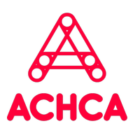
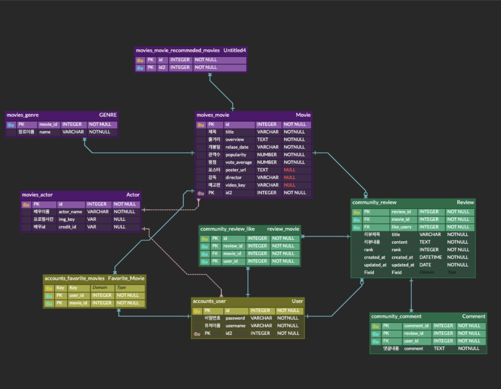
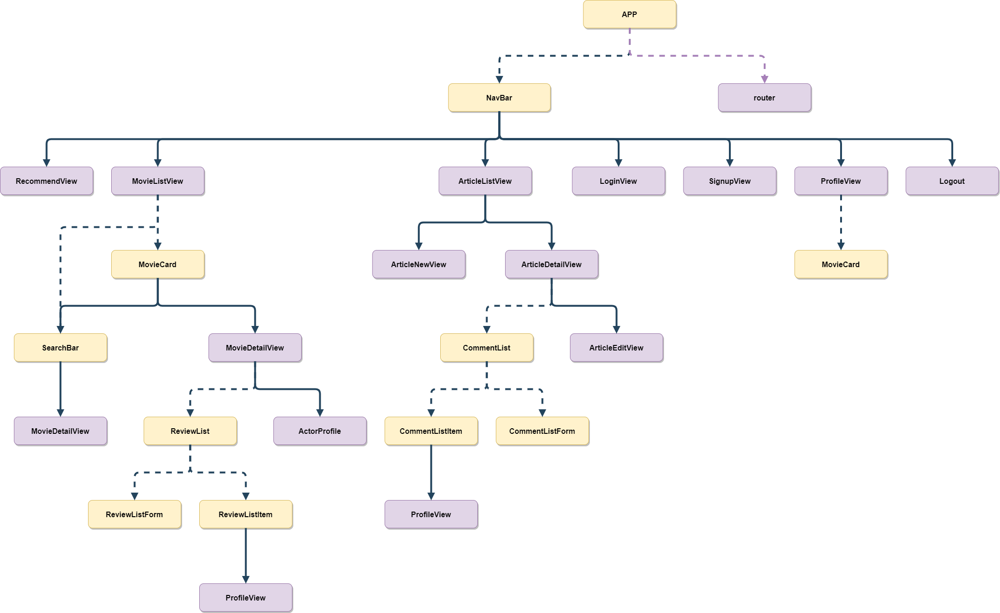
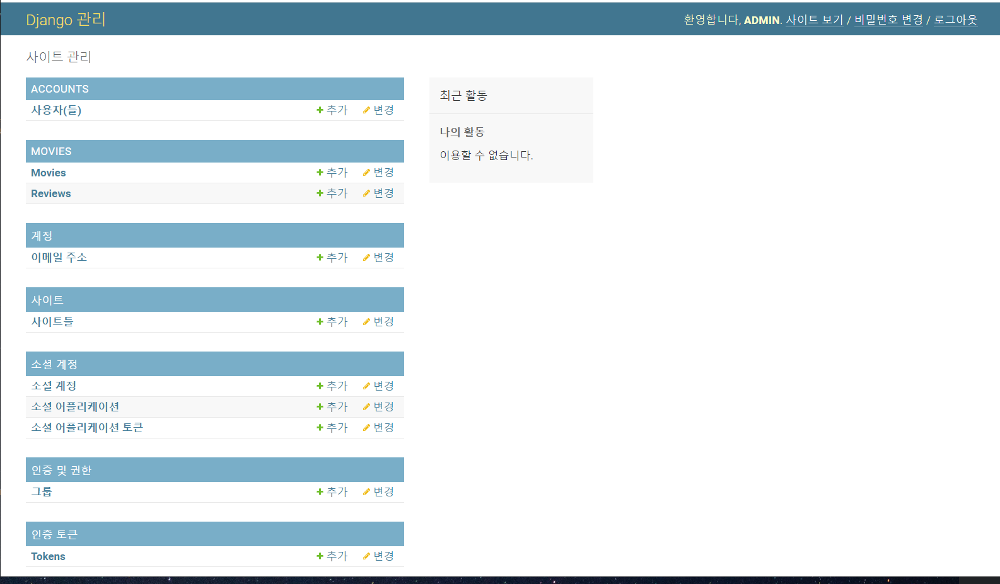

# Final Project


### [ACHCA] 영화 추천 및 커뮤니티 사이트




### 팀원 정보 및 업무 분담 내역

|            | 프레임워크 | 팀원   |
| ---------- | ---------- | ------ |
| 백엔드     | django     | 홍석현 |
| 프론트엔드 | vue.js     | 김다은 |


---

### 목표 서비스 구현 및 실제 구현 정도 

* 


---


### 데이터베이스 모델링 (ERD) 

* #### Django

  


* #### Vue

  

---


### 필수 기능에 대한 설명 

#### A. 관리자 뷰



---


### 배포 서버 URL (배포했을 경우) 

```http
https://achca-movies.netlify.app/
```

---


### 기타 (느낀 점)

---


